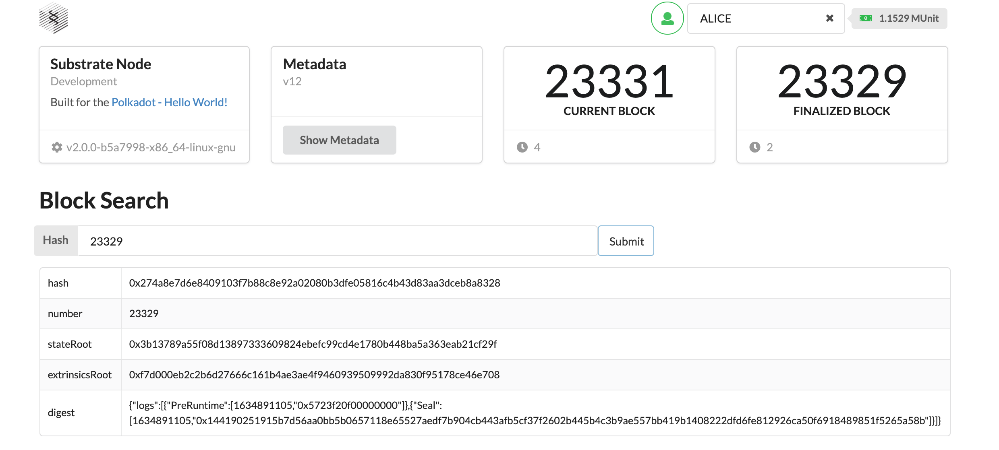
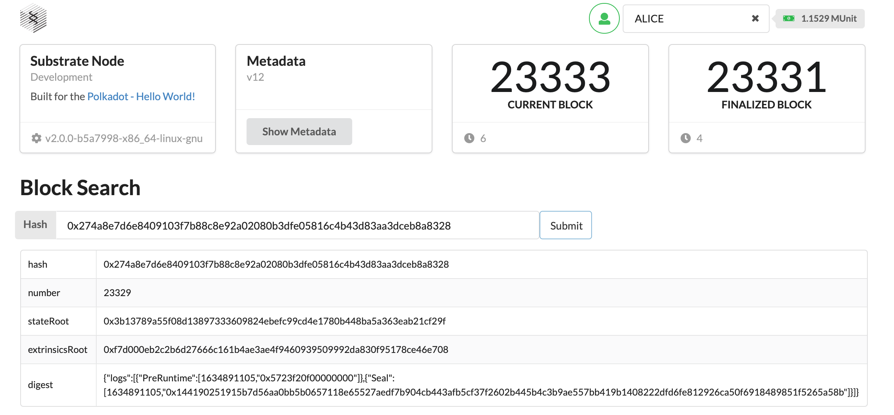
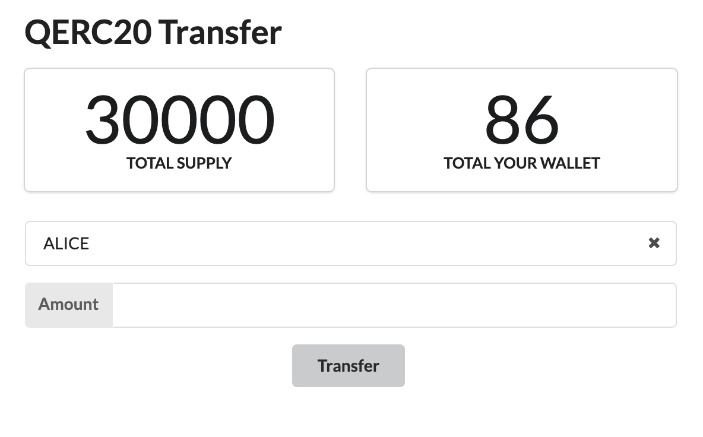
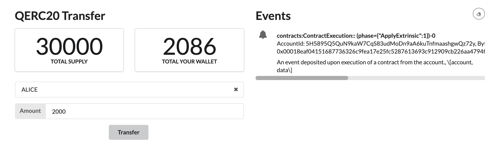
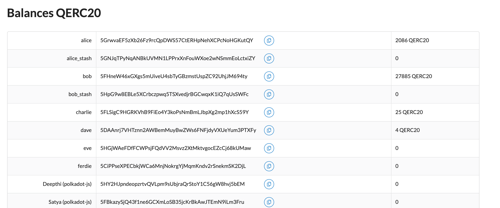

# This example covers following 3 assignments 

## Front-end Javascript
## Write an ERC20 Smartcontract with INC

##Block Searcher - You can search with hash/number 

## ERC20 Smartcontract with INC, you can send between all the sample accounts and on the eventview you can see those extrencics executed 

